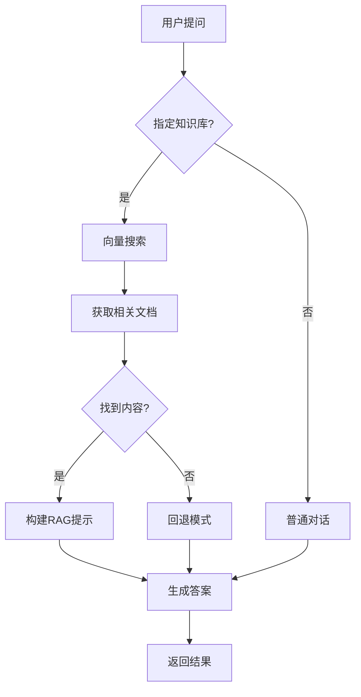

# Spring AI 学习项目

一个基于Spring AI构建的智能对话和RAG（检索增强生成）系统。

## ✨ 主要特性

### 🤖 智能对话
- ✅ 集成DeepSeek大模型
- ✅ 支持思考模式（Reasoning）
- ✅ 流式响应与中断控制
- ✅ Redis聊天记忆存储
- ✅ MySQL历史记录持久化

### 📚 RAG知识问答
- ✅ 多知识库管理
- ✅ 文档智能解析（PDF、Word、文本等）
- ✅ Milvus向量存储
- ✅ 语义搜索与上下文增强
- ✅ 知识库隔离搜索

### 🏗️ 系统架构
- ✅ 模块化分层设计（Chat/RAG/Common）
- ✅ 响应式编程支持
- ✅ 优雅的流控制
- ✅ 完整错误处理

## 🛠️ 技术栈

| 组件 | 技术 | 用途 |
|------|------|------|
| AI框架 | Spring AI | 核心AI能力 |
| 大语言模型 | DeepSeek | 对话生成 |
| 向量数据库 | Milvus | 文档向量存储 |
| 缓存 | Redis | 聊天记忆 |
| 数据库 | MySQL | 历史记录 |
| 文档解析 | Apache Tika | 多格式文档处理 |

## 📁 项目结构

```
src/main/java/com/ally/learn/springailearning/
├── chat/           # 聊天模块
├── rag/            # RAG知识问答模块
├── common/         # 公共组件
├── config/         # 配置管理
├── repository/     # 数据访问层
└── tool/           # 工具类
```

## 🚀 快速开始

### 1. 环境准备
```bash
# 启动依赖服务
docker-compose up -d redis milvus mysql

# 设置环境变量
export DEEPSEEK_API_KEY=your_api_key
export REDIS_HOST=localhost
export MILVUS_HOST=localhost
```

### 2. 启动应用
```bash
mvn spring-boot:run
```

### 3. 基础聊天
```bash
curl -X POST http://localhost:8080/api/chat/stream \
  -H "Content-Type: application/json" \
  -d '{
    "prompt": "你好，请介绍一下自己",
    "chatSessionId": "test-session"
  }'
```

### 4. RAG知识问答

#### 创建知识库
```bash
curl -X POST http://localhost:8080/api/rag/knowledge-bases \
  -H "Content-Type: application/json" \
  -d '{
    "name": "技术文档库",
    "description": "存储技术文档",
    "dimension": 1536
  }'
```

#### 上传文档
```bash
curl -X POST http://localhost:8080/api/rag/documentInfos/upload \
  -F "knowledgeBaseId=your-kb-id" \
  -F "file=@documentInfo.pdf"
```

#### 知识问答
```bash
curl -X POST http://localhost:8080/api/chat/stream \
  -H "Content-Type: application/json" \
  -d '{
    "prompt": "请根据上传的文档回答问题",
    "chatSessionId": "test-session",
    "knowledgeBaseId": "your-kb-id"
  }'
```

## 📚 核心API

### 聊天接口
| 接口 | 方法 | 说明 |
|------|------|------|
| `/api/chat/stream` | POST | 流式聊天 |
| `/api/chat/stop` | POST | 停止流 |

### 知识库管理
| 接口 | 方法 | 说明 |
|------|------|------|
| `/api/rag/knowledge-bases` | GET/POST/PUT/DELETE | CRUD操作 |
| `/api/rag/knowledge-bases/search` | POST | 向量搜索 |

### 文档管理
| 接口 | 方法 | 说明 |
|------|------|------|
| `/api/rag/documentInfos/upload` | POST | 上传文档 |
| `/api/rag/documentInfos/knowledge-base/{id}` | GET | 获取文档列表 |

### 聊天记忆管理
| 接口 | 方法 | 说明 |
|------|------|------|
| `/api/chat/memory/conversations` | GET | 获取对话列表 |
| `/api/chat/memory/status` | GET | Redis状态 |

## ⚙️ 配置文件

### application.properties
```properties
# DeepSeek配置
spring.ai.deepseek.api-key=${DEEPSEEK_API_KEY}
spring.ai.deepseek.chat.options.model=deepseek-chat
spring.ai.deepseek.chat.options.temperature=0.8

# Redis配置
spring.data.redis.host=${REDIS_HOST:localhost}
spring.data.redis.port=${REDIS_PORT:6379}

# Milvus配置
spring.ai.vectorstore.milvus.host=${MILVUS_HOST:localhost}
spring.ai.vectorstore.milvus.port=${MILVUS_PORT:19530}
spring.ai.vectorstore.milvus.embedding-dimension=1536

# 文件上传
spring.servlet.multipart.max-file-size=50MB
```

## 🔄 RAG工作流程



## 🎯 核心特性

### 智能对话
- **流式响应**: 支持实时流式输出
- **思考模式**: DeepSeek推理能力
- **会话管理**: Redis持久化聊天记忆
- **优雅中断**: 支持流响应中断

### RAG增强
- **多知识库**: 独立管理不同领域知识
- **智能解析**: 支持PDF、Word、文本等格式
- **向量搜索**: 基于Milvus的高性能检索
- **上下文增强**: 自动构建相关上下文

### 系统设计
- **模块化**: Chat和RAG功能完全解耦
- **可扩展**: 支持多种文档格式和向量模型
- **高性能**: 异步处理和连接池优化
- **容错性**: 完整的错误处理和回退机制

## 📊 监控指标

- 响应时间统计
- 向量搜索性能
- 聊天记忆命中率
- 文档处理成功率

## 🔧 开发说明

### 主要组件
- **ChatService**: 核心对话服务，支持RAG
- **KnowledgeBaseService**: 知识库管理
- **VectorStoreFactory**: 向量存储工厂
- **StreamControlAdvisor**: 流控制组件

### 扩展指南
- 添加新的文档解析器
- 集成其他向量数据库
- 自定义Embedding模型
- 实现新的检索策略

---

**注意**: 这是一个学习项目，生产使用请考虑安全认证、数据备份、负载均衡等问题。
